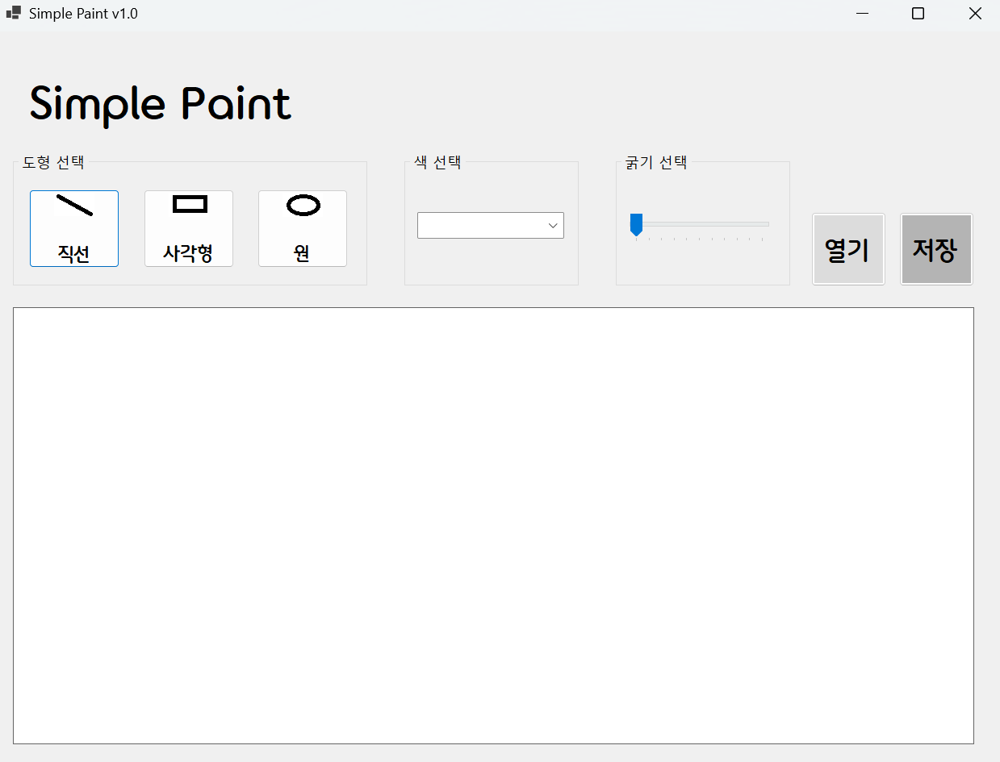

# (C# 코딩) Simple Paint

## 개요
- C# 프로그래밍학습
- 1줄소개: 직선, 사각형, 원을 그리는 그림판 프로그램
- 사용한플랫폼: 
  - C#, .NET Windows Forms, Visual Studio, GitHub
- 사용한컨트롤:
  - Label, Button, ComboBox, TrackBar, PictureBox
- 사용한기술과구현한기능:
 - ㅁㄴㅇㄹ
 - ㅁㄴㅇㄹ
 - ㅁㄴㅇㄹ

## 실행화면(과제1)
- 과제1코드의실행스크린샷

- 과제내용  
 	- UI 구성 : 도형선택, 색선택, 굵기선택, 캔버스 구성
    - 도형 선택 : 버튼 3개를 이용해서 직선, 사각형, 원 선택
    - 색 선택 : ComboBox를 이용해서 검은색, 빨간색, 파란색, 초록색 선택
    - 선 굵기 선택 : TrackBar 이용해서 선 굵기를 1~10단계로 선택
    - 캔버스 : PictureBox를 이용해서 캔버스 구성
 

- 구현내용과기능설명
    - ㅁㄴㅇㄹ
    - ㅁㄴㅇㄹ
    - ㅁㄴㅇㄹ

## 실행화면(과제2)
- 과제2코드의실행스크린샷

- 과제내용
    - ㅁㄴㅇㄹ
    - ㅁㄴㅇㄹ
    - ㅁㄴㅇㄹ

- 구현내용과기능설명
    - ㅁㄴㅇㄹ
    - ㅁㄴㅇㄹ
    - ㅁㄴㅇㄹ

## 실행화면(과제3)
- 과제3코드의실행스크린샷

- 과제내용
    - ㅁㄴㅇㄹ
    - ㅁㄴㅇㄹ
    - ㅁㄴㅇㄹ

- 구현내용과기능설명
    - ㅁㄴㅇㄹ
    - ㅁㄴㅇㄹ
    - ㅁㄴㅇㄹ

## 실행화면(과제4)
- 과제4코드의실행스크린샷

- 과제내용
    - ㅁㄴㅇㄹ
    - ㅁㄴㅇㄹ
    - ㅁㄴㅇㄹ

- 구현내용과기능설명
    - ㅁㄴㅇㄹ
    - ㅁㄴㅇㄹ
    - ㅁㄴㅇㄹ

- 반성할 점과 아쉬웠던 점
    