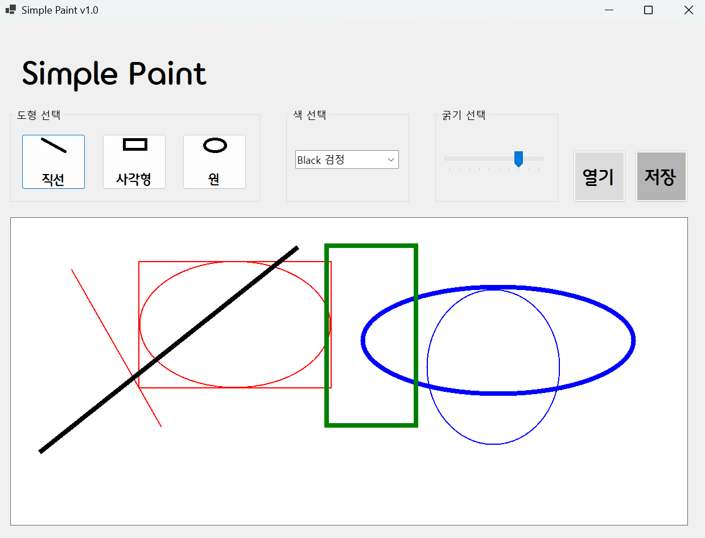
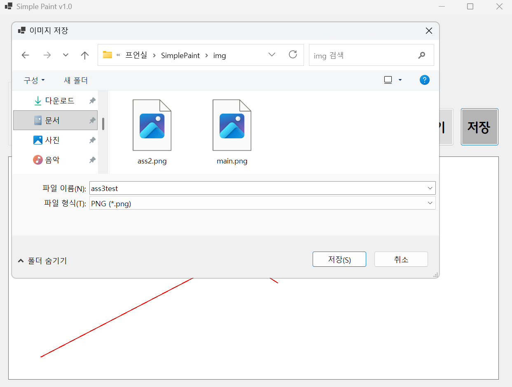
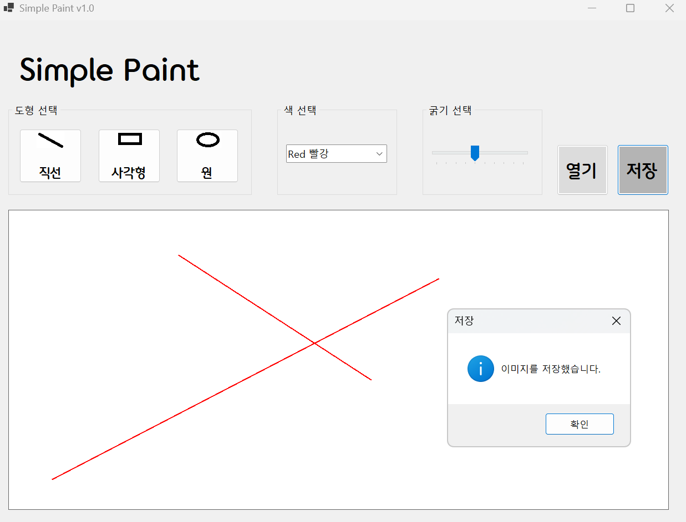
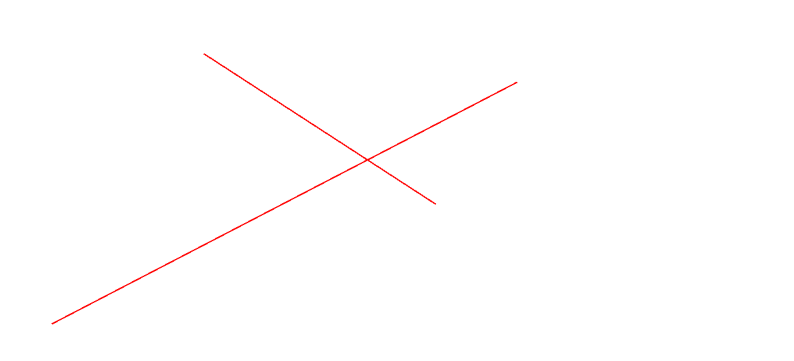
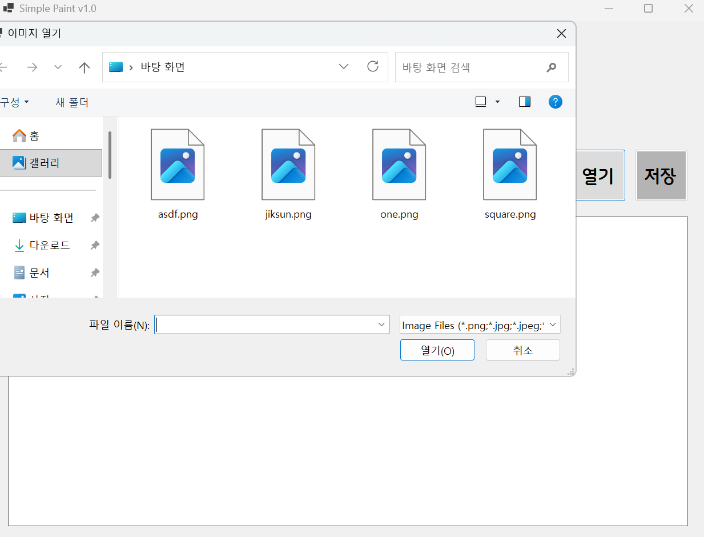
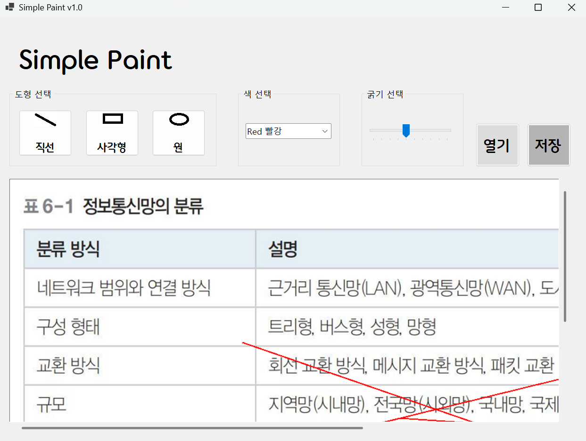

# (C# 코딩) Simple Paint

## 개요
- C# 프로그래밍학습
- 1줄소개: 직선, 사각형, 원을 그리는 그림판 프로그램
- 사용한플랫폼: 
  - C#, .NET Windows Forms, Visual Studio, GitHub
- 사용한컨트롤:
  - Label, Button, ComboBox, TrackBar, PictureBox
- 사용한기술과구현한기능:
 - ㅁㄴㅇㄹ
 - ㅁㄴㅇㄹ
 - ㅁㄴㅇㄹ

## 실행화면(과제1)
- 과제1코드의실행스크린샷

- 과제내용  
 	- UI 구성 : 도형선택, 색선택, 굵기선택, 캔버스 구성
    - 도형 선택 : 버튼 3개를 이용해서 직선, 사각형, 원 선택
    - 색 선택 : ComboBox를 이용해서 검은색, 빨간색, 파란색, 초록색 선택
    - 선 굵기 선택 : TrackBar 이용해서 선 굵기를 1~10단계로 선택
    - 캔버스 : PictureBox를 이용해서 캔버스 구성

## 실행화면(과제2)
- 과제2코드의실행스크린샷

- 과제내용
    - 마우스 드래그를 이용한 그림 그리기 기능 구현
    - 선 색상과 굵기 적용 기능 구현

- 구현내용과기능설명
    - 직선, 사각형, 원 그리기 기능 구현

## 실행화면(과제3)
- 과제3코드의실행스크린샷

- 과제내용
    - 그려진 그림을 이미지 파일로 저장하는 기능 구현

- 구현내용과기능설명
    - 파일 저장을 위한 대화상자인 SaveFileDialog 사용
    -  3가지 포맷으로 저장이 가능하도록 구현 .png, .jpg, .bmp
    - 실제 저장된 사진
 

## 실행화면(과제4)
- 과제4코드의실행스크린샷

- 과제내용
    -  외부 이미지 파일을 읽어 들여서 그걸 캔버스로 삼아 그 위에 그림을그리고, 완성된 그림을 파일로 저장하는 기능 구현

- 구현내용과기능설명
    - 외부에서 이미지 파일을 읽어 들여서 캔버스로 사용
    - 이미지 크기에 맞춰 캔버스 크기 조정
    - 이미지 크기가 큰 경우 스크롤바 만들기
    - 확대/축소 기능 넣기

- 반성할 점과 아쉬웠던 점
    - 확대/축소 기능을 구현하는 것에 있어 어려움을 가졌었다. 한번 확대가 다 된 상태에서는 더이상 축소도, 확대도 되지 않았는데 이 부분을 수정함에 있어서 지식이 늘었음을 체감했다.
    